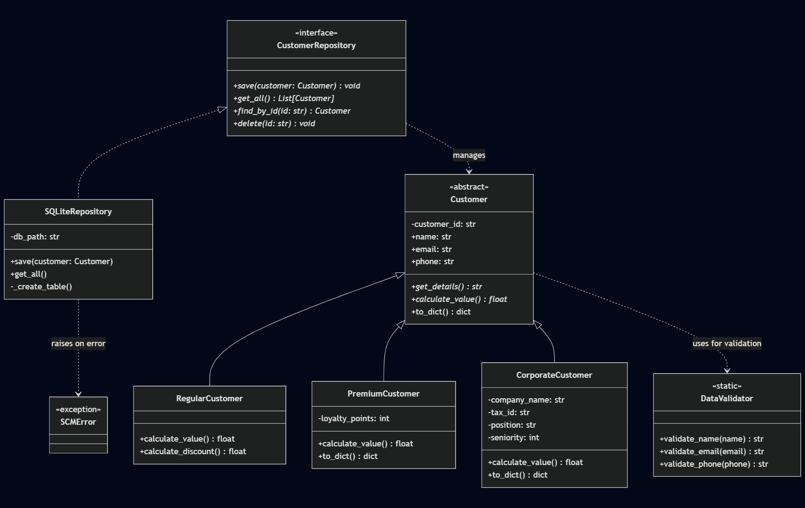

# Smart Customer Manager (SCM)

## Introduction
**SCM** is a robust Python-based solution designed to transform manual data administration into an automated, scalable, and secure system. This project implements advanced OOP principles, strict data validation, and a flexible persistence layer to manage different types of customers (Regular, Premium, and Corporate).

---

## 🚀 Quick Start Guide

### 1. Prerequisites
- **Python 3.8** or higher installed.
- **Git** (optional, for cloning).

### 2. Installation
Clone the repository and navigate to the project folder:
```bash
git clone https://github.com/anibalrojosan/smart-contract-manager.git
cd smart-contract-manager
```

### 3. Running the System
The main entry point is `main.py`. You can run the demonstration with:
```bash
python3 main.py
```

---

## 💾 Persistence Configuration
One of the key features of SCM is its **flexible storage system**. You can switch between a simple JSON file and a professional SQLite database by modifying just one line in `main.py`.

### How to switch storage engines:
Open `main.py` and locate the repository initialization section:

**To use JSON (Local file):**
```python
repo = JSONRepository("storage/customers.json")
# repo = SQLiteRepository("storage/scm_database.db")
```

**To use SQLite (Relational Database):**
```python
# repo = JSONRepository("storage/customers.json")
repo = SQLiteRepository("storage/scm_database.db")
```

---

## 🔄 Data Migration
If you have existing data in a JSON file and want to move it to the SQLite database, run the migration utility:
```bash
python3 migrate_data.py
```

---

## 🛠 Project Structure

```text
smart-customer-manager/
├── core/
│   ├── models.py          # OOP Class hierarchy (Inheritance/Abstraction)
│   └── validators.py      # Data validation logic (Regex)
├── data/
│   └── repository.py      # Repository Pattern (JSON & SQLite)
├── utils/
│   ├── exceptions.py      # Custom SCM exceptions
│   └── logger.py          # System logging configuration
├── storage/
│   ├── customers.json     # Flat-file storage
│   └── scm_database.db    # Relational database storage
├── logs/
│   └── scm_system.log     # Execution and error logs
├── doc/
│   ├── ROADMAP.md         # Project milestones
│   └── DEVLOG.md          # Development history
├── main.py                # Main entry point & Demo script
├── migrate_data.py        # JSON to SQLite migration tool
├── .gitignore             # Git exclusion rules
└── README.md              # Project documentation
```

---

## 📚 Documentation
For detailed project documentation, please refer to the following files:
- `doc/ROADMAP.md`: Project milestones and roadmap.
- `doc/DEVLOG.md`: Development history and progress tracking.

### Class Diagram
The class diagram is a visual representation of the project's class hierarchy and relationships. It is a useful tool for understanding the project's structure and how the classes interact with each other. The diagram is shown below:



---

## 🔮 Future Improvements

Some of the future improvements that are considered are the following:

- **User Interface (UI)**: Develop a modern web interface using **Streamlit** for rapid prototyping or a custom **HTML/CSS/JS** frontend.
- **External Integrations**: Implement connections with external APIs for real-time customer data validation and automated notifications (Email/SMS).
- **Unit Testing**: Implement comprehensive unit tests using **pytest** or **unittest** for critical business logic and validation functions to ensure system reliability.

---
> This project was developed with ❤️ by [Anibal Rojo](https://github.com/anibalrojosan).
