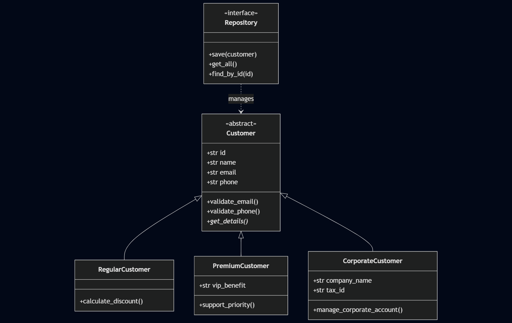

# Smart Customer Manager (SCM)

> This project it's under development. Made with ❤️by [Aníbal Rojo](https://github.com/anibalrojosan).

## Introduction
**SCM** is a robust Python-based solution designed to transform manual data administration into an automated, scalable, and secure system. This project addresses the need of a fictitious company called **SolutionTech** to centralize customer information, eliminating data duplication and improving overall data integrity.

## Key Features
- **OOP Modeling:** Advanced use of inheritance and polymorphism to manage different customer types (Regular, Premium, Corporate).
- **Advanced Validations:** Strict control over contact formats and corporate data using custom exceptions.
- **Flexible Persistence:** Dual-layer implementation starting with JSON and evolving into a relational SQLite database.

## Class Diagram
The classes and their relationships are depicted in the following diagram:

